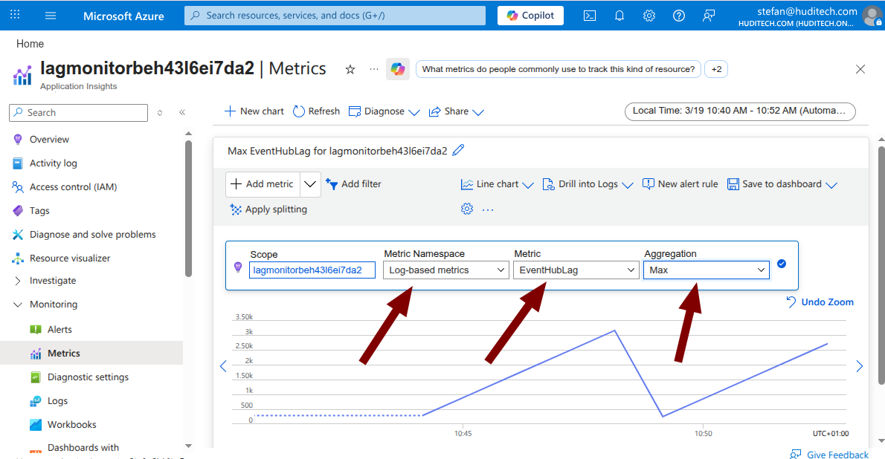
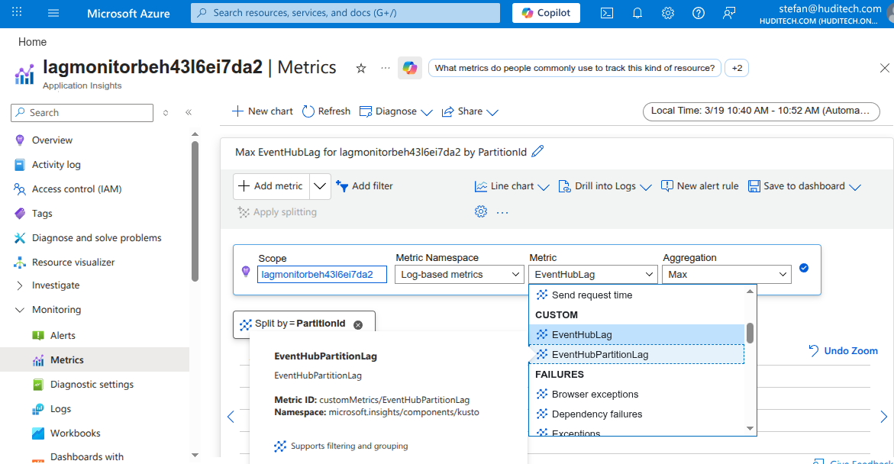
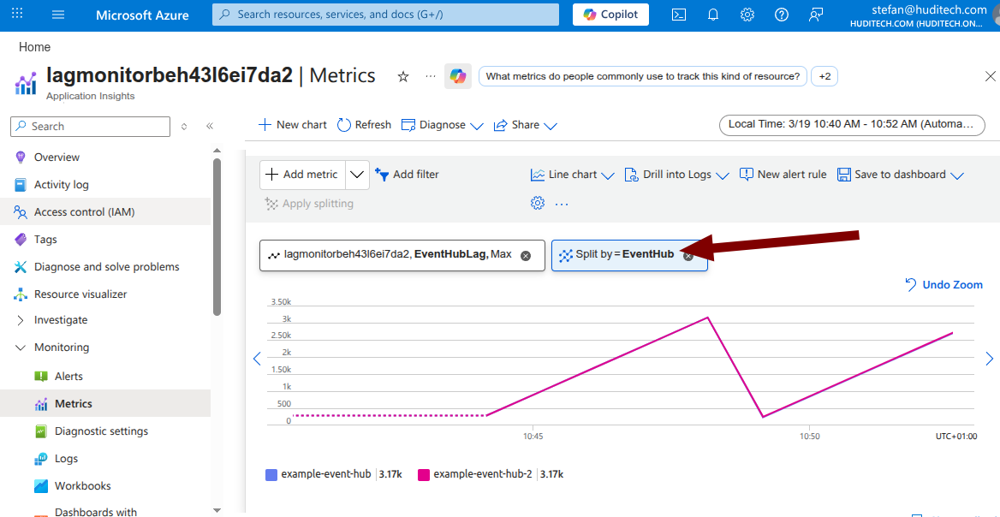
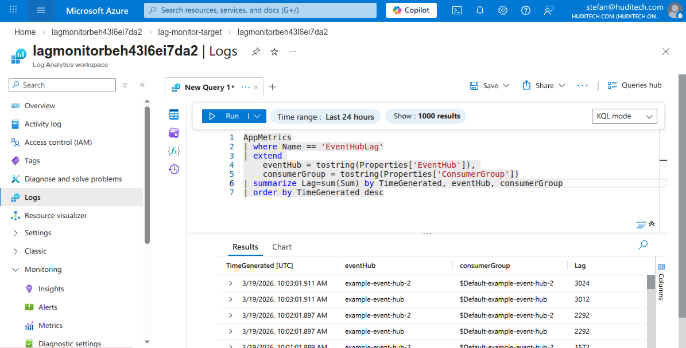
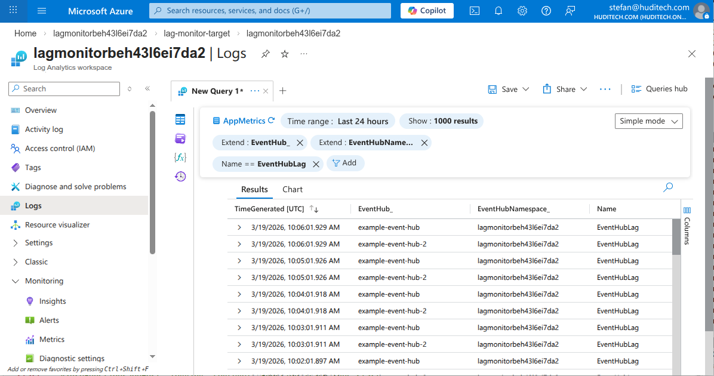

You can view the lag metrics either via your Application Insights instance or via the connected Log Analytics Workspace

## Application Insights

In your Application Insights instance you can see the lag metrics in the `Metrics` section.

Select the metrics as shown in this screenshot:



You can either select the metric that tracks the *total* lag across all partitions or the one that tracks individual partitions:



If you have multiple Event Hubs, apply splitting to see the lags of the individual Event Hubs:



## Log Analytics Workspace

To see the lag metrics in your Log Analytics Workspace, go to `Logs`. Then you can query for the metrics:



Here is an example using `Simple Mode`:



### Lag by Event Hub and Consumer Group

The name of the metric is `EventHubLag`. The value of the metric is the number
of messages that have not yet been processed in the context of a certain event hub and consumer
group.  The values are already summed up over all partitions of the Event Hub. This level of
detail is usually sufficient, as the overall lag across all partitions is most relevant.

Custom dimensions of this metric are:

* `EventHubNamespace`: Name of the Event Hub Namespace.
* `EventHub`: Name of the Event Hub.
* `ConsumerGroup`: Name of the consumer group.

### Lag by Topic, Consumer Group and Partition

The name of the metric is `EventHubPartitionLag`. The value of the metric is the number
of messages that have not yet been processed in the context of a certain event hub, partition and consumer
group.

Custom dimensions of this metric are:

* `EventHubNamespace`: Name of the Event Hub Namespace.
* `EventHub`: Name of the Event Hub.
* `ConsumerGroup`: Name of the consumer group.
* `PartitionId`: Numerical identifier of the partition. If you have 4 partitions, values are 0, 1, 2 and 3.

This metric provides maximum flexibility as it includes information about partitions.

The lag for a particular Event Hub and Consumer Group can be extracted using the following Log Analytics / KQL query:

```kusto
customMetrics
| where name == 'EventHubPartitionLag'
| extend eventHub=tostring(customDimensions['EventHub'])
| extend consumerGroup=tostring(customDimensions['ConsumerGroup'])
| extend partitionId=tostring(customDimensions['PartitionId'])
| where consumerGroup == '$Default' and eventHub == 'example-event-hub'
| summarize lag=sum(value) by bin(timestamp, 1m)
| order by timestamp desc
```

