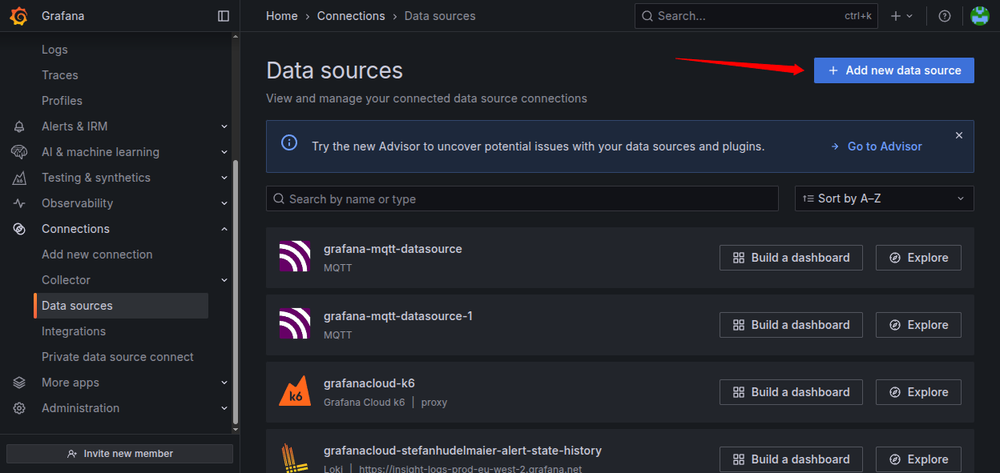
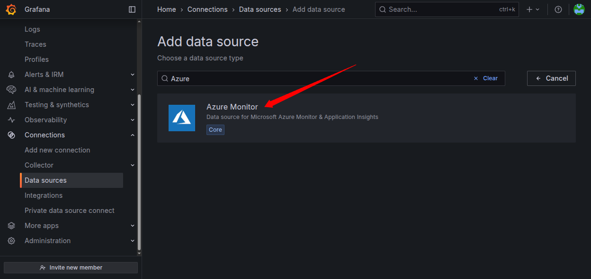
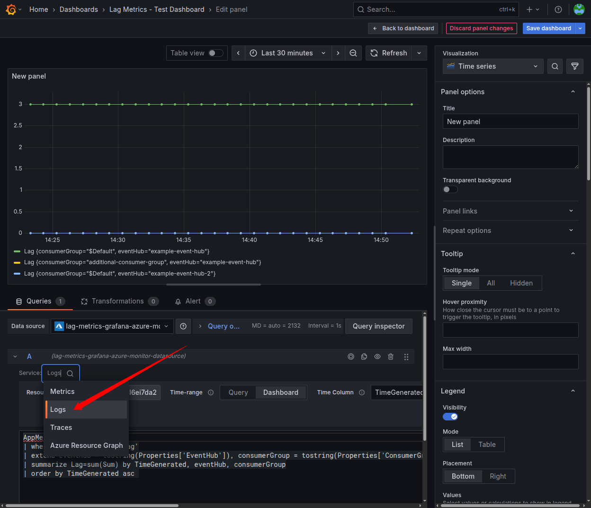
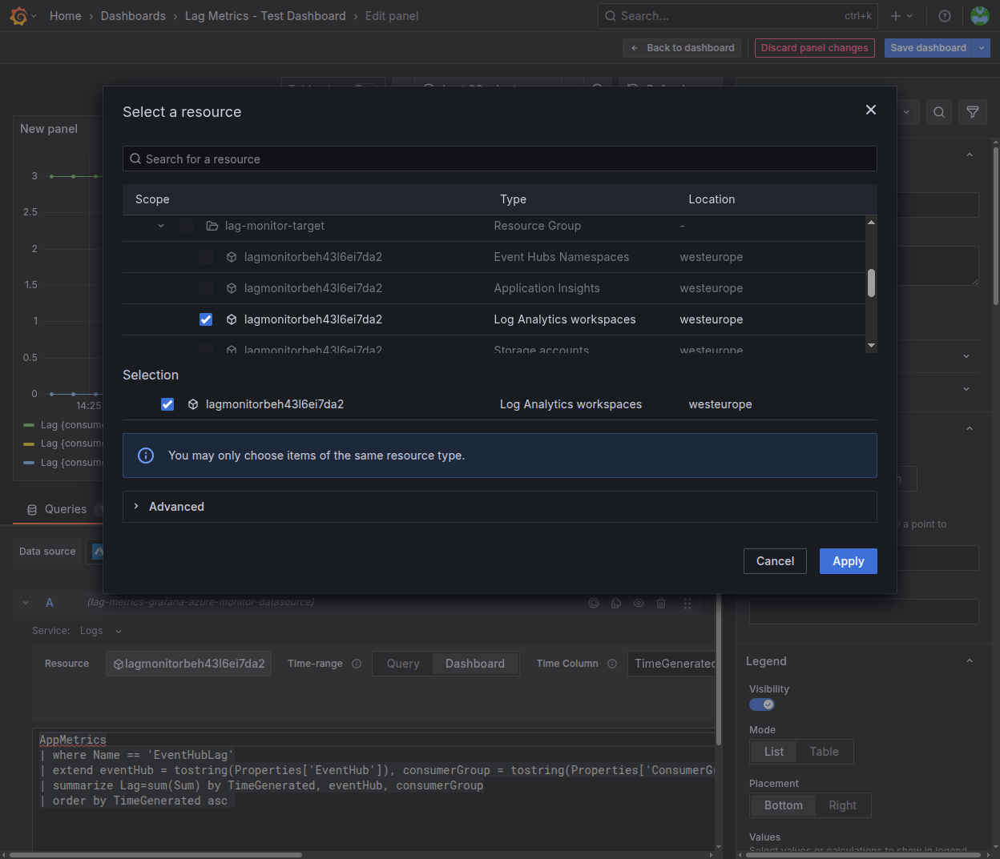
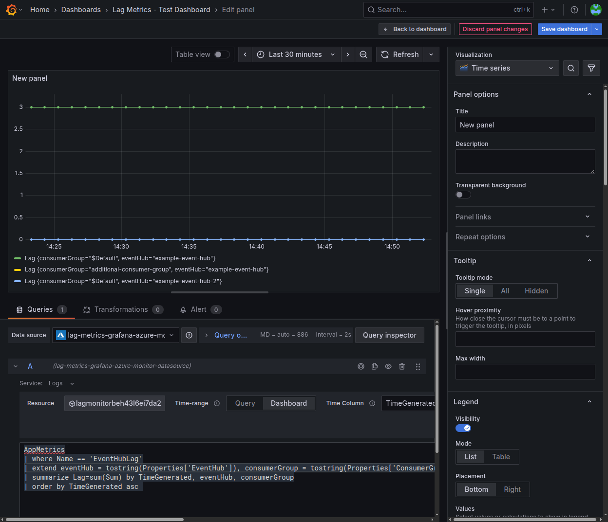
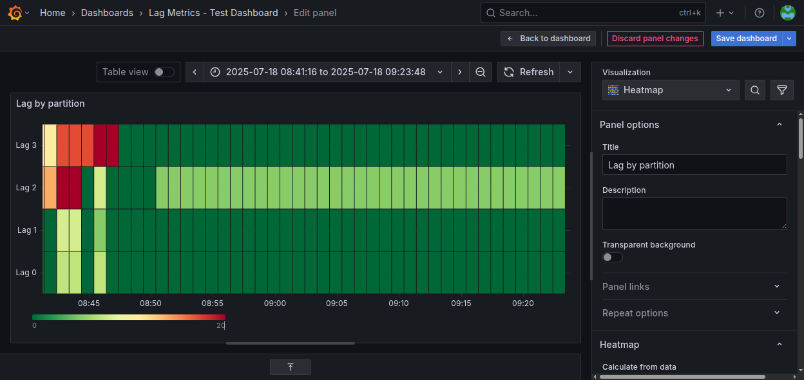
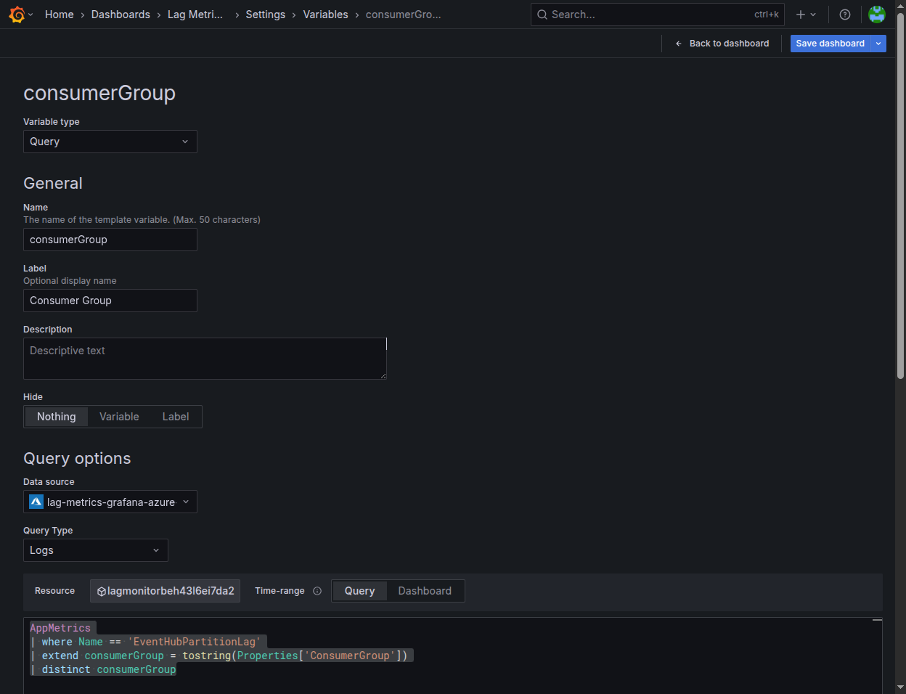
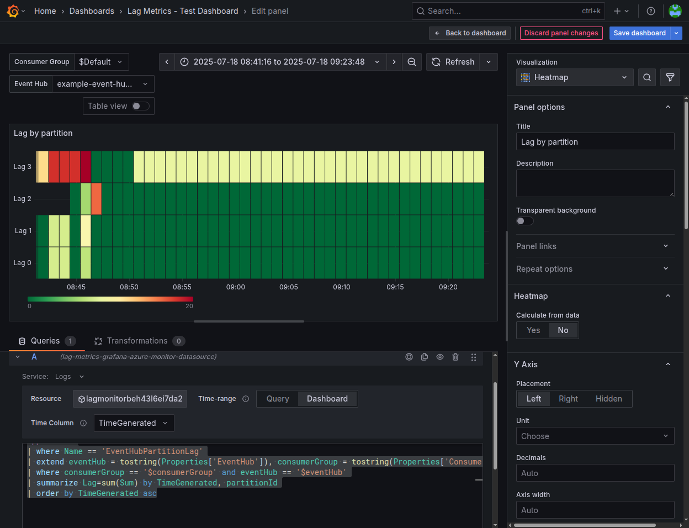

--- 
order: 60
label: Grafana
---

In order to visualize lag metrics on a Grafana dashboard, do the following:

## Configure Data Source

In your Grafana or Grafana cloud installation, add an Azure Monitor datasource (if you do not have one already):





Now, configure the datasource as described in the [Grafana documentation](https://grafana.com/docs/grafana/latest/datasources/azure-monitor/).

## Base Dashboard

You can now create a dashboard. Select the newly added datasource. In `Service` choose `Logs` (this is named a little confusingly).



In `Resources` select your Log Analytics Workspace.



Enter the following KQL query:

```kql
AppMetrics
| where Name == 'EventHubLag'
| extend eventHub = tostring(Properties['EventHub']), consumerGroup = tostring(Properties['ConsumerGroup'])
| summarize Lag=sum(Sum) by TimeGenerated, eventHub, consumerGroup
| order by TimeGenerated asc 
```

You should now see the lags of the different Event Hubs and consumer groups visualized:



## Heat Map

Besides the time series visualization, a heat map can also be handy when analyzing the lag across partitions.

You can create one in the following manner: Create a panel with visualization `Heatmap`.

As above, select the Log Analytics Workspace and choose `Logs` as `Service`. Enter the 
following KQL query:

```kql
AppMetrics
| where Name == 'EventHubPartitionLag'
| extend eventHub = tostring(Properties['EventHub']), consumerGroup = tostring(Properties['ConsumerGroup']), partitionId=tostring(Properties['PartitionId'])
| where consumerGroup == '$Default' and eventHub == 'example-event-hub'
| summarize Lag=sum(Sum) by TimeGenerated, partitionId
| order by TimeGenerated asc
```

Set the `Scheme` to `RdYlGn`. Set the `Start color scale from value` to 0 and `End color scale at value` to e.g. 100 (or whatever lag
for partition you consider problematic).

You should now see something like this:



Now, let's define variables for the different consumer groups and Event Hubs. 
Go to `Settings` > `Variables` > `Add Variable`.

Select `Query` as the `Variable type`, select the correct data source. Set
`consumerGroup` as the `Name`.



Use the following KQL query:

```kql
AppMetrics
| where Name == 'EventHubPartitionLag'
| extend consumerGroup = tostring(Properties['ConsumerGroup'])
| distinct consumerGroup
```

Do the same for a variable `eventHub` with the following KQL query:


```kql
AppMetrics
| where Name == 'EventHubPartitionLag'
| extend eventHub = tostring(Properties['EventHub'])
| distinct eventHub
```

You can now adapt the KQL query on the dashboard to use the variables:

```kql
AppMetrics
| where Name == 'EventHubPartitionLag'
| extend eventHub = tostring(Properties['EventHub']), consumerGroup = tostring(Properties['ConsumerGroup']), partitionId=tostring(Properties['PartitionId'])
| where consumerGroup == '$consumerGroup' and eventHub == '$eventHub'
| summarize Lag=sum(Sum) by TimeGenerated, partitionId
| order by TimeGenerated asc
```

You now can select the Event Hubs and consumer groups.



